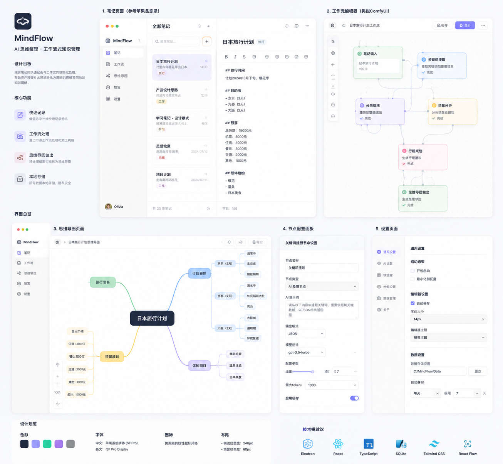

# MindFlow

MindFlow 是一款本地优先的桌面思维整理工具，将笔记、可视化工作流和可编辑思维导图放在同一个安静、轻量的工作空间中。



## 下载 Windows 版

[下载 MindFlow v1.6.1 Windows 版](https://github.com/byc159357-wq/MindFlow/releases/download/v1.6.1/MindFlow-v1.6.1-Windows.zip)

下载后解压整个文件夹，双击根目录中的 `MindFlow.exe`。请不要使用仓库 **Code → Download ZIP**，该入口下载的是开发源码，不包含可直接运行的软件。

## 功能

- 富文本笔记：粗体、斜体、下划线、列表、链接和图片
- 笔记管理：搜索、重点、提醒、右键菜单和删除
- 节点工作流：拖拽节点、连接端口、空白处快速创建节点
- 思维导图：节点和分支可编辑、移动、连接与删除
- 多笔记画布：在工作流和思维导图中切换不同笔记
- 本地任务：一次、每日、每周和自定义周期，支持定时提醒
- 桌面任务挂件：今日与明日任务、完成勾选、开机自启和紧凑模式
- 本地保存：数据保存在本机，不依赖云端或 AI 服务
- 九套界面主题，覆盖浅色、暖色与深色模式
- 另存为 JPG、PNG、Markdown、TXT 与 DOCX

## 技术栈

- Electron
- React 19
- Vite
- React Flow (`@xyflow/react`)
- Phosphor Icons

## 本地运行

需要 Node.js 20+ 和 pnpm。

```bash
pnpm install
pnpm run electron:dev
```

仅运行浏览器开发界面：

```bash
pnpm run dev
```

## 构建 Windows 应用

```bash
pnpm run package:win
```

构建结果会生成在 `release/` 目录。

## 数据与隐私

MindFlow 当前采用本地存储，不上传笔记内容，也不包含 AI 或云端处理功能。

## 许可

当前仓库暂未附加开源许可证。
